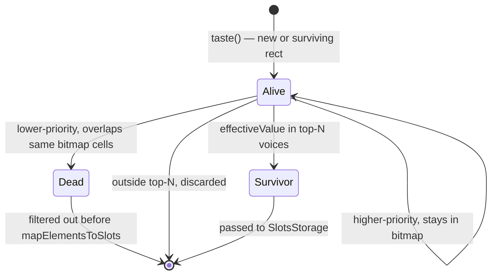
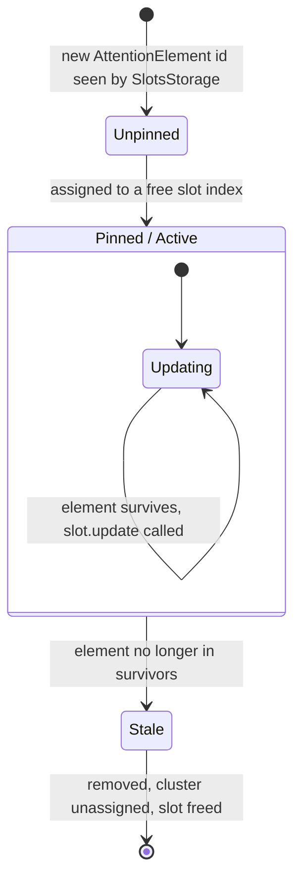
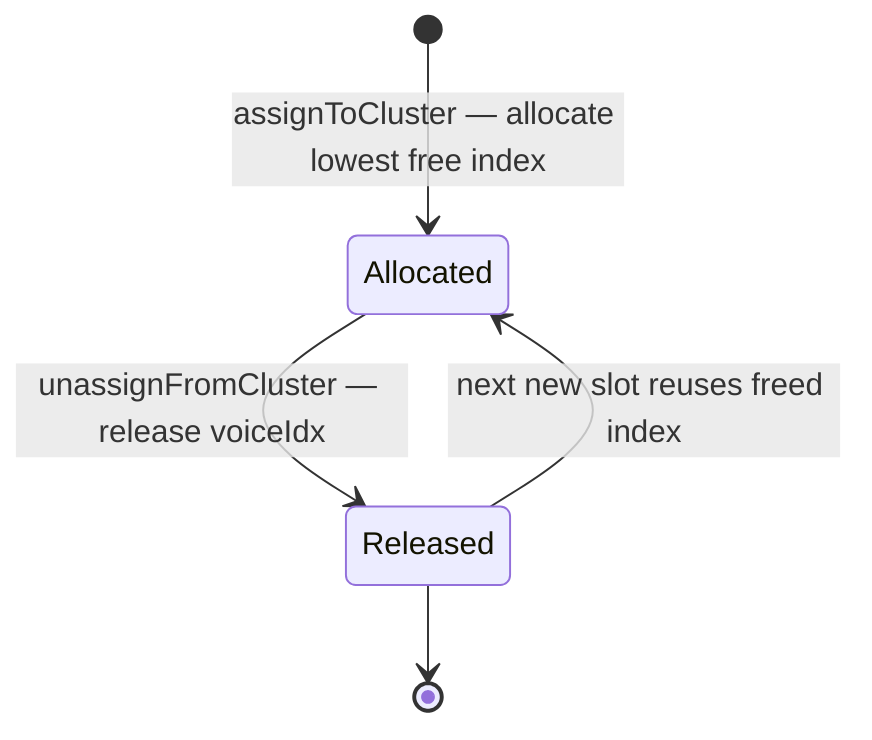

# Element & Slot Lifecycle

Two parallel state machines: the `AttentionElement` (algo-internal) and the `AttentionSlot` (output voice).

## AttentionElement lifecycle (per frame)

## AttentionSlot lifecycle (across frames)

## Cluster voice index lifecycle

